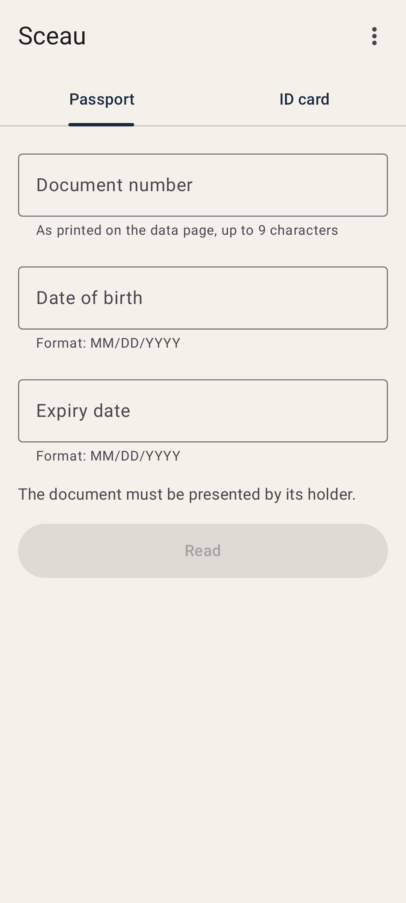
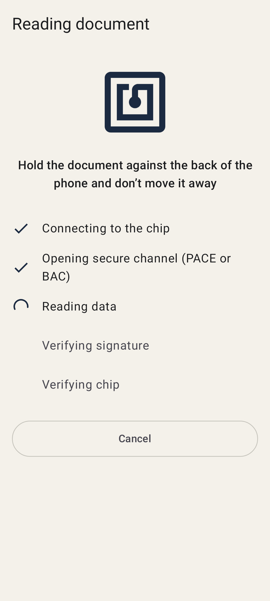
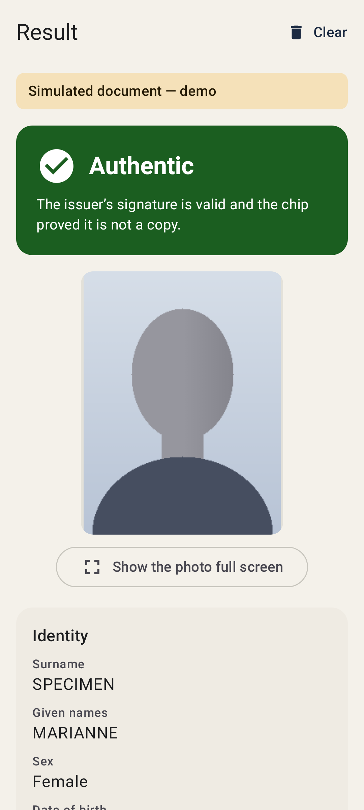
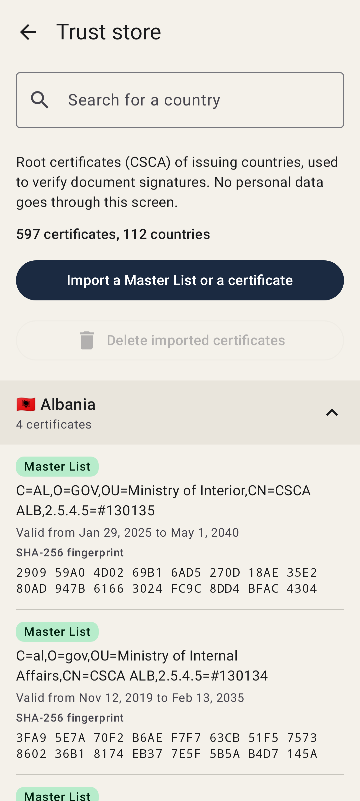
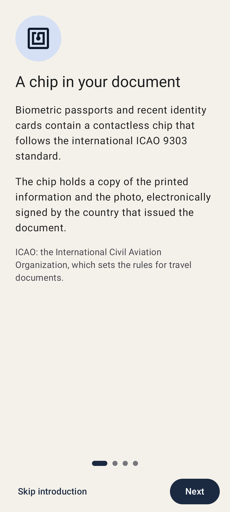

<p align="center">
  
</p>

<h1 align="center">Sceau</h1>

<p align="center">
  Reads the chip of ID cards and passports, and checks they are genuine — fully offline.
</p>

<p align="center">
  <a href="LICENSE"></a>
  
  
  
  
  
  <a href="https://liberapay.com/mgdx"></a>
</p>

<p align="center">
  <a href="https://f-droid.org/packages/io.github.mgdx.sceau/"></a>
  <a href="https://apps.obtainium.imranr.dev/redirect?r=obtainium://app/%7B%22id%22%3A%22io.github.mgdx.sceau%22%2C%22url%22%3A%22https%3A%2F%2Fgithub.com%2Fmgdx%2FSceau%22%2C%22author%22%3A%22mgdx%22%2C%22name%22%3A%22Sceau%22%7D"></a>
</p>

## Description

**Sceau** is an Android application that reads, over NFC, the chip of identity
documents that follow the ICAO 9303 standard — the French electronic identity
card, European identity cards, biometric passports — shows the data and the
photo it holds, and checks cryptographically that the document is genuine and
that the chip is not a clone.

It runs entirely offline: it asks for **no network permission**, keeps nothing
and sends nothing. It is free software under the GPL (version 3 or later) and
uses no Google service.

## Screenshots

<p align="center">
  
  
  
  
  
</p>

## Features

- 📇 **Reads the chip over NFC**, with the CAN (the 6 digits printed on an
  identity card) or the MRZ (document number, date of birth, expiry date), by
  PACE or BAC depending on what the chip announces. A chip that makes you wait
  after failed attempts is waited for up to a minute.

- 🪪 **Shows what the chip holds:** the photo; the identity (surname, given
  names, sex, date of birth, nationality, document type and number, issuing
  state, expiry date); the holder's handwritten signature when the state stores
  it (DG7); and the additional data (DG11, DG12) when present.

- ✅ **Checks that the document is genuine:**
  - *Passive Authentication*: the issuing state's signature over the data is
    verified up to a known root certificate (CSCA), and every data group is
    compared with its signed hash;
  - *Chip Authentication* (including PACE-CAM) and *Active Authentication*: the
    chip proves it holds a secret key, which a clone cannot do;
  - a clear verdict — **Authentic**, **Valid signature, chip not verified**,
    **Unknown issuer** or **Failed** — with a detailed checklist.

- 🔐 **A trust store you can inspect and extend:**
  - shipped with the application: the 5 French CSCA certificates published by
    ANTS, 7 CSCA and link certificates published by their own state (United
    Kingdom, Greece, Georgia, Luxembourg), and the German Master List published
    by BSI, with 112 issuers: the European Union, the EEA, Switzerland, the
    United Kingdom and other states;
  - listed by country, with a search by country;
  - import a Master List published by another state (Italy, Sweden…), or a
    single CSCA or link certificate published by a state, after checking its
    fingerprint; every imported item can be removed on its own.

- 🧽 **Wipes as it goes.** A “Clear” button, the back button or sending the
  application to the background clears the data from memory at once.

- 📖 **Explains itself.** A four-page introduction at first launch, and a
  “What the chip contains” screen listing what is read, what is only used for
  the check, and what is never read.

- 🌍 **45 languages**, chosen per application on Android 13 and later, and a
  dark theme that follows the system.

Sceau does not read fingerprints or iris (reserved for authorities), does not
read the MRZ with the camera and does no facial recognition.

## Supported documents

| Document | Access key | Note |
|---|---|---|
| French national identity card (credit-card format, since 2021) | CAN | Verified through the ANTS e-ID CSCA certificate |
| European identity cards (Regulation (EU) 2019/1157) | CAN if printed, MRZ otherwise | Some older cards have no ICAO application |
| Biometric passports from any country | MRZ | |

A document whose issuer is not in the trust store gets the verdict “Unknown
issuer”: its data is shown, but nothing is guaranteed; you can then import a
Master List or a certificate published by that state. Revocation lists are not
checked, since they would need the network.

Sceau is neither affiliated with nor endorsed by BSI, ANTS or ICAO: it
redistributes, unmodified, certificates and a list that these bodies publish.
The British certificates contain public sector information licensed under the
Open Government Licence v3.0.

### Known limits by country

- **German identity cards.** Cards issued since 2 August 2021 are read: MRZ
  data and photo, then signature and chip checks. Cards issued before that date
  reserve their chip for authorised authorities: Sceau says so and does not
  offer to retry. The address and place of birth are never readable (they need
  the card's PIN and a terminal certificate issued by the German state). The
  eID card for EU citizens holds no identity data: Sceau shows only that it is
  genuine.
- **European identity cards issued before 2 August 2021.** Some have no chip,
  or a chip without an ICAO application. Regulation (EU) 2019/1157 ends their
  validity by 3 August 2031 at the latest.
- **Italian CIE 3.0 cards issued between late 2017 and early 2018.** Italy has
  published a deviation list: on about 346,000 of these cards, DG12 does not
  match the hash signed by the state. Sceau recognises this known deviation,
  sets DG12 aside, and computes the verdict on the rest.

Other limits are reported by third parties without having been checked on real
documents; the details, with sources, are in
[`docs/deviations.md`](docs/deviations.md) (in French).

## Intended use

Sceau is meant for a person to check **their own document**, or a document its
holder presents in person — for instance in a sale between individuals. Reading
the chip needs the CAN or the MRZ printed on the document: it assumes the holder
hands it over willingly.

The photo stored in the chip is biometric data under the GDPR as soon as it is
used for automated comparison with a face. Sceau does no such comparison, and
must not be used to do it without a dedicated legal basis. Comparing the photo
with the person present remains a human, visual check.

The verdict covers the authenticity of the chip and of the data signed by the
issuing state; it does not say whether the document has been reported lost or
stolen. Sceau comes with no warranty (GPL, sections 15 and 16) and its verdict
has no evidential value. It is not an official tool nor a certified identity
verification service, and does not replace the checks that regulations impose
on some professions.

## Privacy

- Only permission: NFC. **No network permission**: the application cannot send
  anything.
- No data read from the chip is written to storage, cache, database or logs.
  The access key is never remembered from one reading to the next.
- Data in memory is wiped when leaving the result screen and when the
  application goes to the background.
- Screenshots and the recent-apps preview are blocked on **every** screen.
- No telemetry, no crash reporting, no analytics or advertising library, no
  Google service.

Details: [`docs/architecture.md`](docs/architecture.md), section “Cycle de vie
des données sensibles”.

## Installing

From [F-Droid](https://f-droid.org/packages/io.github.mgdx.sceau/), which
rebuilds the application from this source. Builds are reproducible, so F-Droid
serves the very APK signed by the author: an installation from F-Droid and one
from the releases page can update one another
([how](docs/reproducible-builds.md)).

Or from the [releases page](https://github.com/mgdx/Sceau/releases/latest),
from tag `v0.9` onwards: one APK per architecture — `arm64-v8a` for almost any
recent phone — plus a universal one that runs on all of them, and a
`SHA256SUMS` file.

To be told when the next version comes out, add the application to
[Obtainium](https://github.com/ImranR98/Obtainium): it watches this
repository's releases and downloads the APK matching your phone.

Requires Android 8.0 or later, with NFC. The application also installs without
NFC and says so when opened.

<p align="center">
  <a href="https://f-droid.org/packages/io.github.mgdx.sceau/"></a>
  <a href="https://apps.obtainium.imranr.dev/redirect?r=obtainium://app/%7B%22id%22%3A%22io.github.mgdx.sceau%22%2C%22url%22%3A%22https%3A%2F%2Fgithub.com%2Fmgdx%2FSceau%22%2C%22author%22%3A%22mgdx%22%2C%22name%22%3A%22Sceau%22%7D"></a>
</p>

## Building from source

You need **JDK 17** (to compile the modules) and **JDK 25** (for the Gradle
daemon, see `gradle/gradle-daemon-jvm.properties`), the **Android SDK**, **NDK
`28.2.13676358`** and **CMake `4.1.2`** (for the native JPEG 2000 decoder). No
key, no account and no third-party service is required.

**1. Clone with the submodule.** The JPEG 2000 decoder is
[OpenJPEG](https://github.com/uclouvain/openjpeg), compiled from its sources,
which are a git submodule; cloning without it gives a build that fails.

```bash
git clone --recurse-submodules https://github.com/mgdx/Sceau.git
cd Sceau
# on an already cloned repository:
git submodule update --init
```

**2. Build, test, install.**

```bash
./gradlew :app:assembleDebug     # debug APKs: app/build/outputs/apk/debug/
./gradlew :app:assembleRelease   # release APKs (R8), unsigned: one per architecture + universal
./gradlew :core:test             # core tests, on the JVM, no phone needed
./gradlew check                  # tests, lint and ktlint, as the CI does; no warning tolerated
adb install -r app/build/outputs/apk/debug/app-universal-debug.apk
```

The project has three modules: `:core`, in pure Kotlin, which reads and verifies
the chip; `:app`, the Android interface; `:testchip`, a simulated ICAO chip and a
fake PKI used by the tests and, in the debug APK only, by a demo mode (home menu
→ “Simulate a French ID card (demo)”) that reads a specimen card without any
real document. Nothing from `:testchip` goes into the release APK.

The release APK weighs **5.5 MB universal** and about 4.7 MB per architecture,
trust store included, against a ceiling of 8 MB. How a release is built, signed
and published: [`docs/release.md`](docs/release.md).

## Dependencies

A handful, each one listed with its licence, checked on the artefact itself, in
[`docs/dependencies.md`](docs/dependencies.md): JMRTD and SCUBA (LGPL 2.1 or
later), BouncyCastle (MIT), OpenJPEG (BSD-2-Clause), Jetpack Compose, Material 3
and AndroidX (Apache 2.0). There is no analytics, crash-reporting or advertising
library under any pretext.

## Contributing

Contributions are welcome — see **[CONTRIBUTING.md](CONTRIBUTING.md)** (in
French), and open an issue before a large change.

- 🌍 **Proofread a translation.** The 44 translations were made without review by
  native speakers; each language has its glossary in
  [`docs/traduction/`](docs/traduction/).
- 🪪 **Report a document** that Sceau reads badly, with its country, type and
  year of issue and the technical code shown on the reading screen — never a
  photo of the document nor any personal data. The application keeps no log.
- 💻 **Write code.** `./gradlew check` must pass without a single warning,
  reading and verification logic goes into `:core` with no Android import, and
  not a single string is hard-coded.

Read [`SPEC.md`](SPEC.md) first: it is the project's source of truth, and
[`docs/decisions.md`](docs/decisions.md) argues every departure from it.

To go further (in French): the [architecture](docs/architecture.md), the
[ICAO protocol](docs/protocol.md), the [trust store](docs/trust-store.md), the
[dependencies](docs/dependencies.md), the [test plan](docs/test-plan.md),
[reproducible builds](docs/reproducible-builds.md) and how a
[release is published and signed](docs/release.md).

And to support the work itself, you can make a donation on
[Liberapay](https://liberapay.com/mgdx).

<p align="center">
  <a href="https://liberapay.com/mgdx"></a>
</p>

## What “Sceau” means

*Sceau* is French for **seal**: the mark an authority presses onto a document
to vouch for it. The chip of an identity document carries its electronic form —
the issuing state's signature over the data — and checking that seal is what
this application does.

## Licence

Sceau is free software under the GNU GPL, **version 3 or (at your option) any
later version** (`GPL-3.0-or-later`): see [`LICENSE`](LICENSE). The logo and the
application icon are under the same licence as the project.

The libraries it uses keep their own licences (LGPL 2.1 or later, MIT,
BSD-2-Clause, Apache 2.0), listed in [`docs/dependencies.md`](docs/dependencies.md).
The embedded certificates and Master List are public data redistributed
unmodified; their sources are in [`docs/trust-store.md`](docs/trust-store.md).
